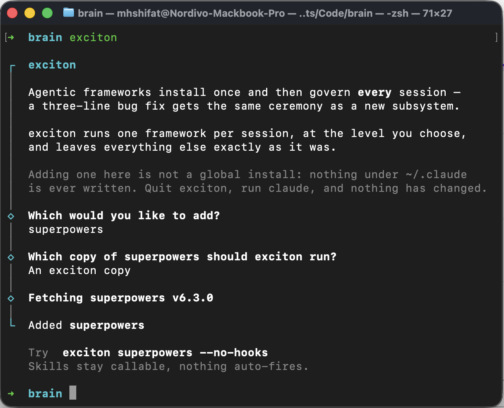

# exciton

**Run Claude Code with an agentic framework dialled to the level the task deserves — for one session, without changing anything else.**

```sh
npm i -g exciton
exciton                          # walks you through it, once

exciton superpowers --no-hooks   # skills stay callable, nothing auto-fires
exciton superpowers              # the full framework, exactly as upstream ships it
```



The first run explains what exciton is and lets you add the frameworks you want —
zero, one, or several. **Adding is not a global install:** nothing under `~/.claude`
is ever written, and your ordinary `claude` sessions are untouched.

An *exciton* is a bound electron–hole pair: it exists only while the system is excited, only inside the medium, and when it recombines the material is exactly as it was. That is what this does — a configuration that lives for one session and leaves your setup untouched.

---

## The problem

Agentic frameworks like [superpowers](https://github.com/obra/superpowers) install once, globally, and then govern **every** session. Claude Code plugins [install enabled by default](https://code.claude.com/docs/en/plugins-reference), and there is no supported per-session dial. So a three-line settled bug fix gets the same design → spec → approval pipeline as a new subsystem.

superpowers' [issue #645](https://github.com/obra/superpowers/issues/645) asked for exactly this — an explicit mode that skips injection but keeps skills callable. It was closed without implementation.

`exciton superpowers --no-hooks` is that feature, from outside, without forking anything.

## Usage

```
exciton <framework> [--no-hooks] [-- claude-args...]
exciton <command>

PROFILES
  (default)      the framework exactly as published, hooks and all
  --no-hooks     skills stay callable, nothing auto-fires

COMMANDS
  add [name]     add a framework, choosing which copy it runs from
                 (--use-installed / --own skip the question)
  remove <name>  take a framework back out
  update [name]  refresh exciton's own copies to the newest release
  list           what is added, and which plugins auto-fire
  clean          empty exciton's cache (refused while a session is using it)
  help, version

EXAMPLES
  exciton superpowers --no-hooks            skills on the shelf, no ceremony
  exciton superpowers --no-hooks -- -c      ...and continue your last session
  exciton superpowers@claude-plugins-official   the full plugin id also works
  exciton ./my-superpowers-fork             a local checkout, judged by its manifest
```

`xc` is installed as a short alias for the same binary.

A framework has to be **added** before it will run. That is the one setup step, and
it is where exciton explains itself rather than assuming you already agree.

## What it touches, and what it doesn't

exciton manages **agentic workflow frameworks** — the things that define *how a session is conducted*. It never touches ordinary plugins.

|  | Frameworks | Ordinary plugins |
|---|---|---|
| Examples | superpowers, BMAD, Spec Kit | design helpers, language servers, MCP integrations |
| What they do | define how the session is conducted | add a capability |
| To each other | **mutually exclusive** — two of them fight over the same job | **compose freely** |
| exciton's stance | dials the one you name, silences the rest | never touches them |

Consequences: naming two frameworks is refused, naming an ordinary plugin is refused, and a bare `exciton` with no framework is a usage error once you are set up — it would launch a session identical to plain `claude`. (On a fresh machine, bare `exciton` is the walkthrough instead.)

## How it works

Two documented Claude Code primitives, nothing else:

| Primitive | Effect |
|---|---|
| `--settings '{"enabledPlugins":{"<id>":false}}'` | removes a plugin entirely for one session |
| `--plugin-dir <dir>` | adds a plugin for one session, from a directory you control |

For `--no-hooks`, exciton stages a copy of the framework with its `hooks/` directory omitted. Hooks are discovered by convention, so removing the directory leaves nothing dangling — the skills remain, and nothing pushes them into the conversation.

**Nothing under `~/.claude` is ever written.** exciton reads your Claude Code configuration and writes only inside `~/.exciton/`. It never runs `claude plugin install`, because installing a plugin enables it globally — the exact problem this exists to avoid. Quit exciton, run `claude`, and it behaves as it always did.

Full detail, including the verification log: [MECHANISM.md](MECHANISM.md).

## Versions

exciton does not offer a choice of versions, deliberately. A framework is either
the copy Claude already has — which Claude keeps current — or exciton's own copy
at the newest release, refreshed with `exciton update`. Choosing between releases
of the same framework is a question almost nobody needs answered, and carrying it
would cost a `@ref` syntax that collides with Claude's own `name@marketplace`
plugin ids.

## Requirements

- Node ≥ 22.18 (running the tests needs the unflagged TypeScript stripping added there)
- Claude Code on your `PATH`
- macOS or Linux (Windows is not supported)
- `git`, for fetching a framework you don't already have installed

## Status

1.0.0. The mechanism is documented by Anthropic and cross-verified by an integration suite that asserts against Claude Code's own debug output — including that no Claude state file is modified. The command surface is settled; widening it is a semver commitment.

Currently ships one framework, `superpowers`. Adding another is deliberate: it needs a staging profile known to work for that framework's hook layout, not just a new string in a set.

```sh
npm test                   # unit tests
npm run test:integration   # asserts real Claude Code behaviour; needs claude installed
```

## Documentation

| | |
|---|---|
| [PRODUCT.md](PRODUCT.md) | what it is, who it's for, scope and risks |
| [MECHANISM.md](MECHANISM.md) | how it works, and the evidence for every claim |
| [QA.md](QA.md) | questions, answers, and the reasoning behind each decision |
| [PROBLEM.md](PROBLEM.md) | the validated problem this addresses |
| [PLAN.md](PLAN.md) | the v1 implementation plan — historical, superseded by 1.0.0 |

## License

MIT
